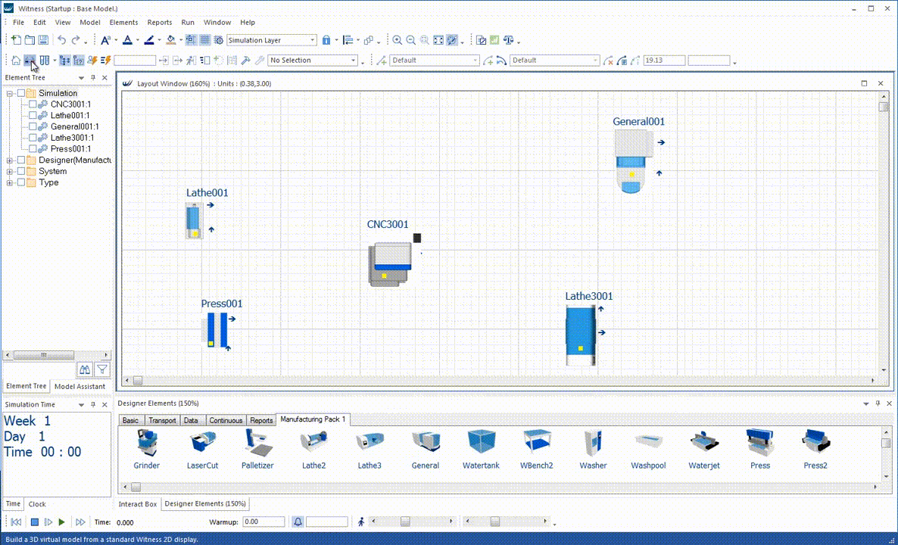
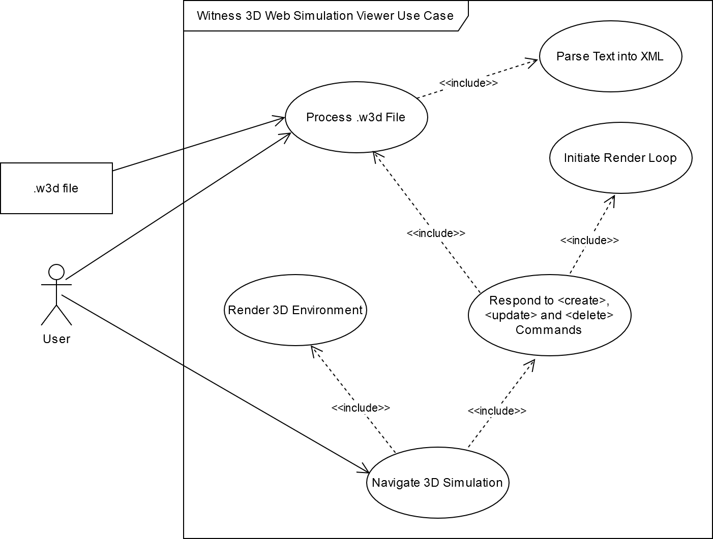
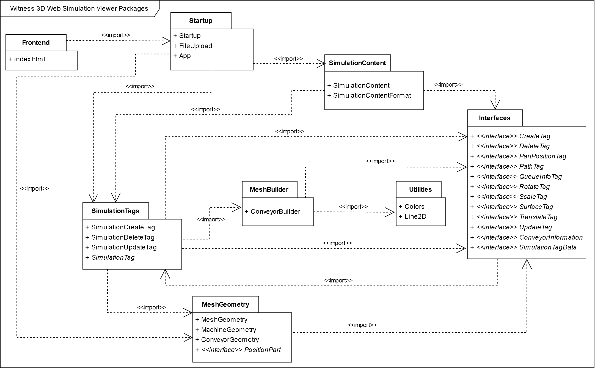
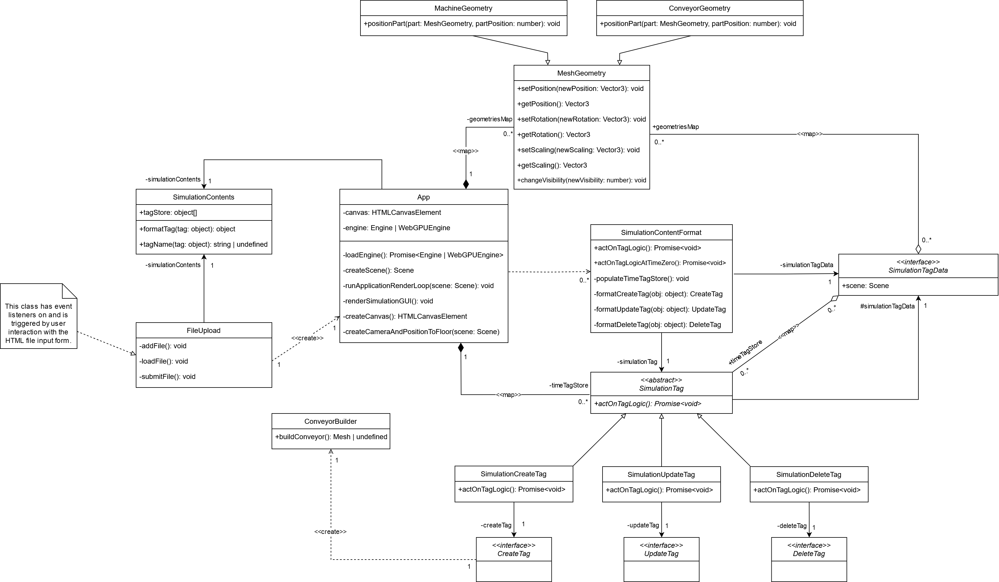

# Witness3DWebSimulationViewer

## Overview

Witness 3D Web Simulation Viewer is a 3D web app that can show simulations running over time.

The simulations will come from [Witness](https://www.lanner.com/en-gb/technology/witness-simulation-software.html). Witness is a discrete event simulation modelling environment allowing domain experts to create simulation models of systems. Witness runs on Windows desktop. Witness has an option to create a 3D view from positional information in the 2D view. From the 3D visualisations in Witness, a detailed simulation trace output can be captured that describes all the 3D movements in the simulation over time.

The project is to use the simulation trace output to visualise these simulations running in 3D on the web. Because such visualisation capabilities come built into Witness, this project is a proof-of-concept demonstrating how feasible it is to shift these visualisation capabilities onto the browser and, through this, identify the costs and potential limitations.

By shifting the visualisation of simulations onto the browser, the intended benefit is to access opportunities for real-time collaboration by visualising the simulation from the same trace output file; the ability to visualise simulations will no longer be restricted to Windows desktops with an installation of Witness.

There are different approaches that can be taken to achieve these aims (eg, WebGL vs. WebGPU). The project will compare the different approaches and justify the approaches it takes.

**Demonstration of Witness Desktop 3D Visualisation Capabilities**

**Use Case Diagram**

**Note**: `.w3d` is the official filename extension of simulation trace output files generated from the main Witness application. Any files uploaded to Witness 3D Web Simulation Viewer for processing without this filename extension will immediately be rejected. Furthermore, such file must contain the expected XML format, relaying the simulation events through the core \<create\>, \<update\> and \<delete\> commands. An error will be thrown if Witness 3D Web Simulation Viewer is unable to parse the uploaded `.w3d` file following the expected XML structure. Reference to the expected XML format can be found in [Witness W3D Queue Implementation](./WitnessDocs/Witness%20W3D%20Queue%20Implementation.pdf) and [WITNESS-Unity Proof of Concept 01](./WitnessDocs/WITNESS-Unity%20Proof%20of%20Concept%2001.pdf).

**Package Diagram**

**Class Diagram**

## Technologies

Babylon.js, Vite and TypeScript will be used to create the web application. Creating a Babylon.js web application using a Vite development environment is an established approach with an official [page](https://doc.babylonjs.com/guidedLearning/usingVite) on the Babylon.js documentation. An important advantage is that, unlike other module bundlers for JavaScript such as Webpack, Vite is able to reflect changes made to the source code immediately; unlike Webpack, it does not need to compile all the files into a JavaScript bundle before the web app hosted on the development server can reflect the new changes. This makes development quicker with Vite. Furthermore, Vite has fewer config files than its competitors, such as Webpack, and is therefore easier to maintain.

Run on a browser with native WebGPU support, such as Google Chrome, Witness 3D Web Simulation Viewer will automatically detect such compatibility and respond by initialising Babylon.js using the [WebGPUEngine](https://doc.babylonjs.com/typedoc/classes/BABYLON.WebGPUEngine) class. Run on a non-compatible browser and Witness 3D Web Simulation Viewer will intialise Babylon.js using the standard [Engine](https://doc.babylonjs.com/typedoc/classes/BABYLON.Engine) class, which uses WebGL2 rather than the newer WebGPU JavaScript API.

(**Note**: As described in the official documentation, full Babylon.js support with WebGPU is still a work in progress, and, as a result, Witness 3D Web Simulation Viewer is more likely to encounter errors when using the WebGPU engine. Babylon.js aims to achieve full feature parity with WebGPU by version 5).

# Getting Started

## Prerequisites

- Clone the GitHub repo, and run `npm i` (short for install) to install Babylon.js, Vite and the other npm dependencies.
- Immediately after installing the necessary Node.js packages, run `npm up` (short for update). Based on the configuration in `package.json`, this will update the node packages to all future minor and patch versions, ensuring that the latest versions are used without breaking compatibility. From time to time, this command should be run to minimise the chance of bugs and security vulnerabilities.
- Run `npm run dev` to begin a development server running the code. The server will begin on port `4000`.
- To stop the server, go back to the terminal and press Ctrl+C.

## Installing

- Run `npm run build`. This will bundle the application, outputting this bundle to the `dist` folder within the root directory, creating this directory if it does not already exist.
- Run `npm run preview` to see the exported code bundle running in a local development server.
- Now the contents of the `dist` folder can be uploaded to an external server, deploying the application.

## Husky pre-commit hook

`.husky\pre-commit` contains the contents of a pre-commit Git hook as per the [Husky](https://typicode.github.io/husky/) standard. This script will thus run each time you run `git commit`. Along with linting staged files to enforce code style, the script will run a Node.js script to automatically update the patch version number as held within `package.json`. Such updated `package.json` file will automatically be added to the outgoing commit.

The `--no-verify` (shortened to -n) Git commit flag can bypass the pre-commit hook. Therefore, run `git commit -n` to make a commit without updating the version number. **Important**: this should be used sparingly, only for commits involving very trivial changes.

## Debug

Witness 3D Web Simulation Viewer is developed and debugged in Visual Studio Code. It is recommended to use Visual Studio Code for debugging due to its built-in debugging capabilities.

To do open a debugging environment in Visual Studio Code, open a `JavaScript Debug Terminal` and run `npm run dev` to begin the development server as usual. From here, the application will stop at any breakpoints set in Visual Studio Code.

Alternatively, many web browsers offer debugging capabilities that can be used for debugging Witness 3D Web Simulation Viewer.

# Running the tests

Witness 3D Web Simulation Viewer uses the Vitest testing library, created by the same team as the Vite build tool and comes with Vite integration, to create unit tests.

Test configuration is located in the `vitest.config.ts` file, which is also where the Vite configuration is located.

## Run Tests

- Run `npm test`. This will initiate a single run of the unit tests.

## Code Coverage

A successful test run will produce code coverage. The directory for code coverage is `coverage`, which is ignored by Git.

## Debug Tests

A run of Vitest unit tests can be debugged in VS Code. To do this, open a `JavaScript Debug Terminal` and run `npm run test`. For more information, go to the Vitest [official documentation](https://vitest.dev/guide/debugging).

# Quick3D Models

As Witness 3D Web Simulation Viewer is a prototype, its compatibility is limited, and, in this instance, its visualisation capabilities is limited to two trace output files `Quick3D.w3d` and `Quick3D-Large.w3d`, both of which are found within `./WitnessModels`.

`Quick3D.w3d` is the simulation trace output file that was used during the development of Witness 3D Web Simulation Viewer, and for this reason, compatibility is guaranteed. It represents the Quick3D trace file capture of running the `Quick3D.mod` simulation model (also found within `./WitnessModels`) for 200 minutes. Once those 200 minutes are up, the various parts and labour elements will be deleted.

`Quick3D-Large.w3d` represents the Quick3D trace file capture of running the `Quick3D-Large.mod` simulation model also for 200 minutes, a scaled-up version of the `Quick3D.mod` simulation model. To test the scalability of the Quick3D function in Witness and note the differences in performance, the `Quick3D-Large.w3d` simulation model consists of 12 separate instances of the original `Quick3D.mod` simulation model running simultaneously. Thus, its corresponding simulation trace output file can be uploaded to Witness 3D Web Simulation Viewer for similar purposes: to test the performance capabilities of the application knowing that it already has compatibility of the original `Quick3D.w3d` is the simulation trace output file. Likewise, it will delete all of the parts and labour elements in the simulation when 200 minutes (in the simulation) have passed.

Further information on the difference in performance between the `Quick3D.mod` simulation model and the scaled up equivalent `Quick3D-Large.mod` can be found in the _witness-dev-witness-unity-spike_ document linked to below.

# Important Links & Docs

- [3D Command Reference 21](./WitnessDocs/3D%20Command%20Reference%2021.pdf)
- [Part Queuing Positions Overview 01](./WitnessDocs/Part%20Queuing%20Positions%20Overview%2001.pdf)
- [The WebGPU Sourcebook](./WitnessDocs/The%20WebGPU%20Sourcebook.pdf)
- [Witness W3D Queue Implementation](./WitnessDocs/Witness%20W3D%20Queue%20Implementation.pdf)
- [witness-dev-witness14-3D](./WitnessDocs/witness-dev-witness14-3D.pdf)
- [witness-dev-witness-unity-spike](./WitnessDocs/witness-dev-witness-unity-spike.pdf)
- [WITNESS-Unity Proof of Concept 01](./WitnessDocs/WITNESS-Unity%20Proof%20of%20Concept%2001.pdf)

## Witness Team User Testimonial (11 March 2025)

Evidence of the success of Witness 3D Web Simulation Viewer was provided on the 11th of March 2025 in the form of a user testimonial document from the Witness team. [(Witness 3D Web Simulation Viewer Feedback)](./WitnessDocs/Witness%203D%20Web%20Simulation%20Viewer%20Feedback.pdf). This document describes how the deliverable was demonstrated to the simulation group of 40 people and concludes that the deliverable gives the Witness team the confidence that they "can utilize a web visualization technology such as WebGPU, using a library like Babylon js, to extend the reach of dynamic 3D simulation visualization beyond the desktop."

# Last Updated

This README was last updated on 21 April 2025.
